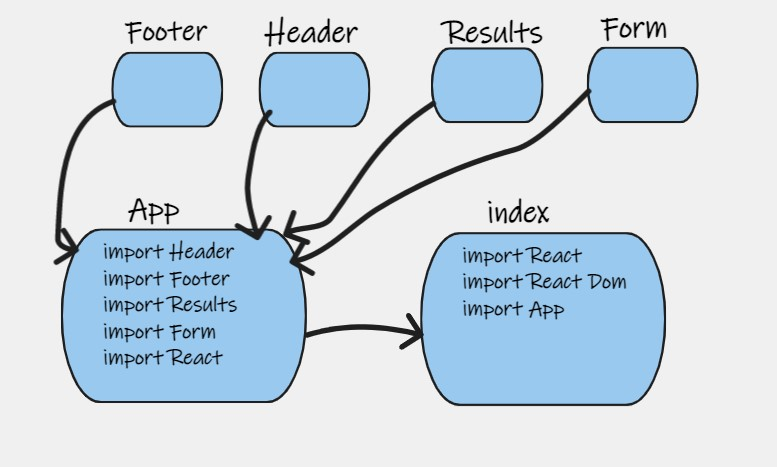

# resty App

- The first of a 4-Phase build of the RESTy application, written in React. In this first phase, our goal is to setup the basic scaffolding of the application, with intent 
being to add more functionality to the system as we go. This initial build sets up the file structure so that we can progressively build this application in a scalable 
manner

- URL

- [PR base](https://github.com/ManalKhAlbahar/resty/pull/2).
- [PR state](https://github.com/ManalKhAlbahar/resty/pull/3).
